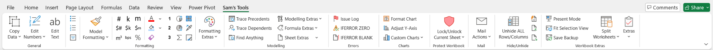

# Sam's Tools Excel Toolbar Addin

Sam's Tools is an Excel add-in designed to help those who spend lots of time in Excel to be more productive! It provides a suite of tools to quickly clean data, analyse information, format and present insights. While many paid products offer similar or more advanced functionalities, I'm sharing Sam's Tools so others can access these tools who may not have the budget for expensive software.

To install on Windows (Mac not supported):
- Download the `.xlam` in the [releases page](https://github.com/often-curious/SamsTools/tree/main/releases)
- **Important!** Follow the [installation instructions](https://github.com/often-curious/SamsTools?tab=readme-ov-file#installing--uninstalling)

## Why I Created This

As a finance nerd who spends hours in Excel, I found I was constantly repeating some actions over and over. I looked into VBA as a way to automate these actions and over time started building a toolbar so I could access them quickly. I also saw other examples across the internet of cool ideas for macros that help make Excel life easy, so I've encorporated these in over the years too.

## Requirements

- **Microsoft Office**: Sam's Tools was developed on the latest version of Office, but it may work on older versions with potential bugs.
- **Windows or Mac**: While Sam's Tools definitely works on Windows, it might also be usable on Mac, however it has not been tested and I don't have any plans to support Macs at this stage either sorry. 

## Features 

Below are some key features, though not all are listed.

| Icon                                                                                                           | Feature                                                   | Description                                                                                |
|----------------------------------------------------------------------------------------------------------------|-----------------------------------------------------------|--------------------------------------------------------------------------------------------|
|                                                      | Edit Text                                       | Change case (e.g. Upper, Lower, Sentence) or Insert/Delete characters from strings.                                                        |
| More Features to come...   |          |   |

## Installing & Uninstalling

### Installation Instructions

A step-by-step guide to installing **Sam's Tools** in Excel:

#### For Windows

1. **Prerequisite**: Ensure any previous versions of Sam's Tools are uninstalled to avoid conflicts.
2. **Download Sam's Tools**: Download the latest [release of Sam's Tools](https://github.com/often-curious/SamsTools/tree/main/releases) (i.e., `.xlam` file).
3. **Move the File**: Place the `.xlam` file in the correct add-ins folder: `C:\Users\[Your Username]\AppData\Roaming\Microsoft\AddIns`
4. **Configure Excel**:
   - Open Excel and go to **File** > **Options**.
   - Select **Add-ins**.
   - Under the **Manage** section, select **Excel Add-ins** and click **Go**.
5. **Add Sam's Tools**:
   - Click **Add New** in the add-ins window.
   - Navigate to the folder where you saved the Sam's Tools `.ppam` file, select it, and click **OK**.
6. **Complete Installation**:
   - The Sam's Tools tab should now appear in the Excel ribbon, confirming successful installation.

### Uninstallation Instructions

A step-by-step guide to uninstalling **Sam's Tools**:

1. **Open Excel**: Ensure Excel is open and that the Sam's Tools tab is visible in the ribbon.
2. **Access Add-Ins**: 
   - Go to **File** > **Options**, then select **Add-ins**.
3. **Manage Add-Ins**: 
   - Under the **Manage** section, select **Excel Add-ins** and click **Go**.
4. **Remove Sam's Tools**:
   - In the add-ins window, select **Sam's Tools** from the list and click **Remove**.
5. **Complete Uninstallation**:
   - Close the add-ins window. The Sam's Tools tab should disappear from Excel, confirming that the add-in has been successfully uninstalled.

## How You Can Contribute

You are welcome to submit issues and bug reports via this GitHub repository. I will review them whenever I can.

## How to Develop Your Own

You have three alternatives based on your skill level:

### For Beginners
   1. **Build from the `.xlam` file**: 
     - I suggest this approach if you are just starting out and want to use or customize the existing code without diving too deeply into VBA or advanced development.

### For Advanced Users
   2.  **Fork this repo**: If you are familiar with Git and want to customize the project, you can fork this repository.
   3. **Build your own `.xlam` file**:You can start from scratch or use this repo as a base and develop your own `.xlam` file, adding or modifying the macros to suit your needs.

## How to Edit the Code
To edit the macros and custom functionality within the `.xlam` file, follow these steps:

1. **Enable the Developer Tab in the Ribbon**: If you don't already have the Developer tab visible, activate it by following [this guide](https://support.microsoft.com/en-us/office/show-the-developer-tab-in-word-e356706f-1891-4bb8-8d72-f57a51146792).

2. **Access the VBA Editor**: Click on the `Developer` tab, then click on `Visual Basic` to open the VBA editor.

3. **Navigating the VBA Editor**:
   - **Modules Folder**: 
     - This is where you should place your macros. Macros are scripts written in VBA that automate tasks in Excel.
   - **Forms**:
     - You can create custom forms (dialog boxes) that interact with the user. Forms contain controls like buttons, text fields, and checkboxes to gather user input or perform specific tasks.
    
4. **Edit the Ribbon:** Download the [Office RibbonX Editor](https://github.com/fernandreu/office-ribbonx-editor) to edit the ribbon

### Additional Resources
- [VBA Documentation](https://docs.microsoft.com/en-us/office/vba/api/overview/excel) – Microsoft's official documentation for Excel VBA.
- [StackOverflow Excel VBA](https://stackoverflow.com/search?q=excel-vba) – For questions and community support related to Excel VBA.

## Other Amazing Open Source Tools
- [Office Fluent UI Identifiers](https://github.com/OfficeDev/office-fluent-ui-command-identifiers): A great resource for finding identifiers to make the add-in look seamless.