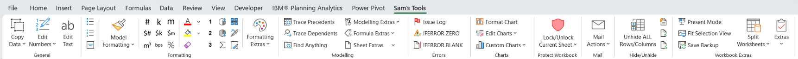
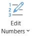
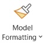
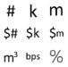
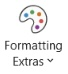
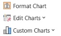
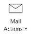
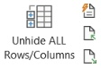
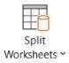

# Sam's Tools Excel Toolbar Add-in

Sam's Tools is an Excel add-in designed to help those who spend lots of time in Excel to be more productive! It provides a suite of tools to quickly clean data, analyse information, format and present insights. While many paid products offer similar or more advanced functionalities, I'm sharing Sam's Tools so others can access these tools who may not have the budget for expensive software.

To install on Windows (Mac not supported):
- Download the `.xlam` in the [releases page](https://github.com/often-curious/SamsTools/tree/main/releases)
- **Important!** Follow the [installation instructions](https://github.com/often-curious/SamsTools?tab=readme-ov-file#installing--uninstalling)

## Why I Created This

As a finance nerd who spends hours in Excel, I found I was constantly repeating some actions over and over. I looked into VBA as a way to automate these actions and over time started building a toolbar so I could access them quickly. I also saw other examples across the internet of cool ideas for macros that help make Excel life easy, and I've incorporated these ideas over the years too.

## Requirements

- **Microsoft Office**: Sam's Tools was developed on the latest version of Office, but it may work on older versions with potential bugs.
- **Windows or Mac**: While Sam's Tools definitely works on Windows, it might also be usable on Mac, however it has not been tested and I don't have any plans to support Macs at this stage either sorry. 

## Features 

Below are some key features, though not all are listed.

| Icon                                                                                                              | Feature                                                   | Description                                                                                |
|----------------------------------------------------------------------------------------------------------------|-----------------------------------------------------------|--------------------------------------------------------------------------------------------|
|    |Copy Data          |Copy both structured and unstructured data, plus create live snapshots which will continuously update as the reference cells are updated.   |
|                                                      | Edit Text                                       | Change case (e.g. Upper, Lower, Sentence) or Insert/Delete characters from strings.                                                        |
|    |Edit Numbers          |Quickly multiply or divide numbers in the selected ranges, or convert absolute numbers (e.g. 50) into percentages (e.g. 50%), plus change the sign (e.g. +50 becomes -50).   |
|    |Model Formatting          |Preset model formats to quickly format cells as inputs, calculations, links, errors etc...   |
|    |Value Formatting          |Quickly format values as absolute, dollars, bps and +/- % - the thousands (k) and millions (m) buttons display the numbers in the respective formats without changing the number.    |
|    |Colour Formatting          |Pre-define your key brand colour and set them as 1, 2, or 3 (this will let you apply the brand formatting to any cell, table or chart selected and needs to be configured in the 'Formatting Extras' menu) you can also make the selected cell/object bighter or darker, format cell outlines white, and pick colours from selected cells.  |
|    |Formatting Extras          |The menu includes functions such as setting the brand colours, converting merged cells to centre across, ...   |
|    |Trace Precedents          |A more insightful approach to auditing formulas to see which cells precede (or are inputs to) the outcome.   |
|    |Trace Dependents          |A more insightful approach to auditing formulas to see which cells depend on (or use the selected cell as inputs) for their outcome.   |
|    |Find Anything          |Dynamic search function which will display all results as you type and let you select which ones to go to.   |
|    |Modelling Extras          |Create a Table of Contents, highlight plugs in formulas (hardcoded values), view a list of all external links in a model and export a full model map.   |
|    |Formula Extras          |Tidy up formulas and make them formatted better so they are easy to read, remove broken names and load some custom Lambdas to the name manager.  |
|    |Sheet Extras          |Basic excel sheet formatting setup for each new sheet, plus quick insert the sheet name, and sequential numbers/letters to create an index, or insert/delete x number of rows which can be helpful for tidying up messy data.   |
|    |Issues          |Create an issue log to capture and review any problems in a model, plus quick link to wrap any formulas with an iferror that returns either blank or zero.   |
|    |Charts          |   |
|    |Lock/Unlock Sheets          |Add protection to sheets and create a custom password that you can use to lock and unlock sheets or entire workbooks. The main button is a toggle that quickly locks and unlocks the active sheet.   |
|    |Mail          |Send only the selected sheets (rather than Excel's default of the entire workbook), or select to send sheets as values if you only need to share the output from a sheet.  |
|    |Hide/Unhide          |Unhide all hidden rows & columns on the active sheet (including grouped cells), plus hide or unhide selected sheets in the workbook.   |
|    |Present Mode          |Easy way to hide the ribbon and make the sheet fullscreen when presenting or sharing your screen with others.   |
|    |Split Worksheets          |Split the active workbook by turning each sheet into a seperate file (either .xlsx or .pdf).   |
|    |Other Extras          |Some extras include: agenda template, calendar template, motivational quotes, text to speech function, magic number game and more!   |
|    |Right-click menu          |Have also added some other quick formatting functions to the right-click menu to make it easy for format commonly used types.   |
|    |F1 Key Disabled          |By default the F1 key is also disabled so no more chances of accidentially pressing it and no need to remove the key from my keyboard (which I had previously done on a few occasions).   |

## Installing & Uninstalling

### Installation Instructions

A step-by-step guide to installing **Sam's Tools** in Excel:

#### For Windows

1. **Prerequisite**: Ensure any previous versions of Sam's Tools are uninstalled to avoid conflicts.
2. **Download Sam's Tools**: Download the latest [release of Sam's Tools](https://github.com/often-curious/SamsTools/tree/main/releases) (i.e., `.xlam` file).
3. **Move the File**: Place the `.xlam` file in the correct add-ins folder - paste the following in your file explorer: `%appdata%\Microsoft\addins` or `C:\Users\[Your Username]\AppData\Roaming\Microsoft\AddIns`
4. **Configure Excel**:
   - Open Excel and go to **File** > **Options**.
   - Select **Add-ins**.
   - Under the **Manage** section, select **Excel Add-ins** and click **Go**.
5. **Add Sam's Tools**:
   - Click **Add New** in the add-ins window.
   - Navigate to the folder where you saved the Sam's Tools `.xlam` file, select it, and click **OK**.
6. **Complete Installation**:
   - The Sam's Tools tab should now appear in the Excel ribbon, confirming successful installation.

### Uninstallation Instructions

A step-by-step guide to uninstalling **Sam's Tools**:

1. **Open Excel**: Ensure Excel is open and that the Sam's Tools tab is visible in the ribbon.
2. **Access Add-Ins**: 
   - Go to **File** > **Options**, then select **Add-ins**.
3. **Manage Add-Ins**: 
   - Under the **Manage** section, select **Excel Add-ins** and click **Go**.
4. **Remove Sam's Tools**:
   - In the add-ins window, select **Sam's Tools** from the list and click **Remove**.
5. **Complete Uninstallation**:
   - Close the add-ins window. The Sam's Tools tab should disappear from Excel, confirming that the add-in has been successfully uninstalled.

## Disclaimer

This add-in is provided free of charge and is developed in my spare time.

While I use these tools regularly in professional environments, no warranty is provided and users should test functionality before relying on it for critical workbooks.

Always keep backups of important files.

## How You Can Contribute

Bug reports, feature requests, and suggestions are welcome.

Please submit an issue through GitHub and include:
- Excel version
- Operating system
- Steps to reproduce the issue
- Screenshots (if applicable)

While this is a hobby project and responses may not be immediate, I will try review all submissions.

## How to Develop Your Own

You have three alternatives based on your skill level:

### For Beginners
   1. **Build from the `.xlam` file**: 
     - I suggest this approach if you are just starting out and want to use or customize the existing code without diving too deeply into VBA or advanced development.

### For Advanced Users
   2.  **Fork this repo**: If you are familiar with Git and want to customize the project, you can fork this repository.
   3. **Build your own `.xlam` file**:You can start from scratch or use this repo as a base and develop your own `.xlam` file, adding or modifying the macros to suit your needs.

## How to Edit the Code
To edit the macros and custom functionality within the `.xlam` file, follow these steps:

1. **Enable the Developer Tab in the Ribbon**: If you don't already have the Developer tab visible, activate it by following [this guide](https://support.microsoft.com/en-us/office/show-the-developer-tab-in-word-e356706f-1891-4bb8-8d72-f57a51146792).

2. **Access the VBA Editor**: Click on the `Developer` tab, then click on `Visual Basic` to open the VBA editor.

3. **Navigating the VBA Editor**:
   - **Modules Folder**: 
     - This is where you should place your macros. Macros are scripts written in VBA that automate tasks in Excel.
   - **Forms**:
     - You can create custom forms (dialog boxes) that interact with the user. Forms contain controls like buttons, text fields, and checkboxes to gather user input or perform specific tasks.
    
4. **Edit the Ribbon:** Download the [Office RibbonX Editor](https://github.com/fernandreu/office-ribbonx-editor) to edit the ribbon

### Additional Resources
- [VBA Documentation](https://docs.microsoft.com/en-us/office/vba/api/overview/excel) – Microsoft's official documentation for Excel VBA.
- [StackOverflow Excel VBA](https://stackoverflow.com/search?q=excel-vba) – For questions and community support related to Excel VBA.

## Other Amazing Open Source Tools
- [Office Fluent UI Identifiers](https://github.com/OfficeDev/office-fluent-ui-command-identifiers): A great resource for finding identifiers to make the add-in look seamless.

## Support More of This
If you love these tools and want to support a few of the late nights I've had building them, feel free to contribute to buying me a coffee...

